<h1 align="center">DigitalClockLogic-DigitalWorks</h1>

<p align="center"> Esse projeto foi feito para a prática de Raciocínio Lógico utilizando números Binários...  </p>

<br>

<h1 align="center">
  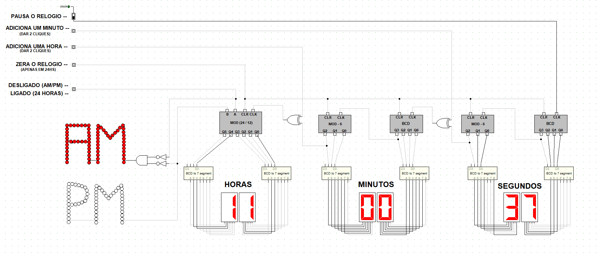 
 </h1>

<br>

## Tabela de conteúdos
<!-----ts----->
  * [Sobre](#sobre)
    * [Instalação](#instalação)
    * [Funcionalidades](#funcionalidades)
  * [Funcionamento](#funcionamento)
    * [Estrutura Digital](#estrutura-digital)
    * [Contadores Assincornos](#Contadores-Assincronos)
  * [Conclusões](#conclusões)
  * [Contatos](#contatos)


# Sobre
<P>Como todo desenvolvedor iniciante, um dos primeiros estudos é o raciocínio lógico. Assim como em trabalhos escolares e práticas de raciocínio lógico, o desafio foi criar um relógio 100% digital utilizando apenas flip-flops, portas lógicas e números binários.</P>

<br>


## Instalação

```bash
1- Faça o download do simulador Digital Works
$ Arquivo: DigitalWorks.zip

2- Faça o download do projeto
$ Arquivo: RELOGIO FINAL.dwm

3- Abra o projeto utilizando o simulador
```
<br>

## Funcionalidades

- [x] Start/Stop
- [x] Clear
- [x] Adicionar horas e minutos
- [x] Exibição em formato AM/PM e 24 horas

# Funcionamento

<p>Cada módulo tem a função de contar até um valor específico. Por exemplo, os módulos dos segundos realizam a contagem de 0 até 59 segundos (60 valores). Após atingir o máximo da contagem, o módulo das dezenas dos segundos emite um pulso para o módulo das unidades dos minutos, adicionando um valor ao display de 7 segmentos. Os módulos dos minutos seguem o mesmo processo dos segundos. Após atingir o máximo da contagem, um pulso é enviado para o módulo das horas, aumentando assim as horas.

A contagem é armazenada em binário, onde cada flip-flop do circuito armazena um bit. Em seguida, cada sequência de bits é decodificada para ser apresentada nos displays de 7 segmentos.</p>

## Estrutura Digital 

<p>São empregados circuitos sequenciais, como os flip-flops, para armazenar os bits de cada contador.</p>

### O que é um circuito sequencial?

<p>Enquanto o bloco básico de um circuito combinacional é a porta lógica, nos circuitos sequenciais, o elemento fundamental é o latch ou o flip-flop (circuito biestável). A principal vantagem dos circuitos sequenciais é sua capacidade de memória.

Os latches ou flip-flops são compostos por portas lógicas (NAND ou NOR). A interconexão desses flip-flops resulta em circuitos lógicos sequenciais utilizados para armazenamento de dados, temporização, contagem e sequenciamento.

Circuitos lógicos sequenciais são caracterizados pela realimentação das saídas para as entradas, conhecida como estado interno. Isso faz com que as condições atuais das entradas e do estado interno determinem a condição futura da saída.</p>

<p align="center">
  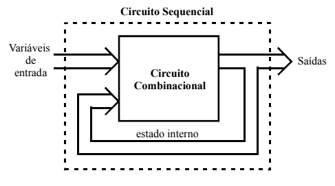 
 </p>

<br></br>
 
 ### FLip-Flop JK

<br></br>

 <p align="center">
  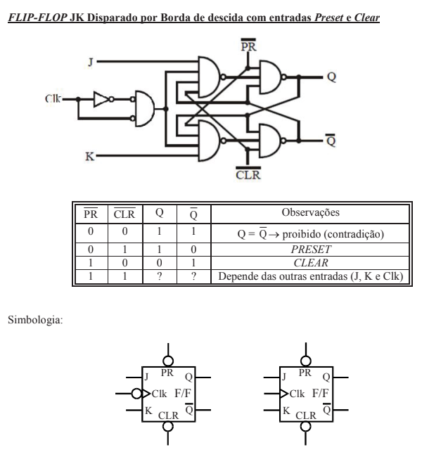 
 </p>

<br></br>

## Contadores Assíncronos 

<p>Contadores são diversos Flip-flop ligados entre eles, onde cada flip-flop vai armazenar um bit do nosso valor numérico. </p>

<p align="center">
  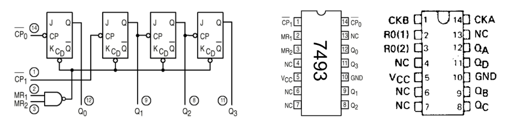 
 </p>

<br></br>

<p>No exemplo, podemos contar até o número 15, o que equivale a 2^4 (16 valores de 0 a 15).

A cada pulso do nosso clock "CP0", ocorre uma alteração no estado do primeiro Flip-Flop JK. Assim, ao iniciar, temos 0000; após o primeiro pulso, obtemos 0001; depois 0010; e assim por diante, até atingir o máximo, que seria 1111.</p>

<br>

### Contador modulo 6 e contador-BCD 

<p>Para o projeto, são utilizados contadores BCD e módulo 6 para registrar os minutos e segundos. O contador BCD é responsável pela contagem de 0 a 9, representando as unidades, enquanto o módulo 6 realiza a contagem das dezenas de 0 a 5. Combinando esses dois contadores, obtemos uma contagem completa de 00 a 59, abrangendo tanto minutos quanto segundos. Essa abordagem proporciona uma maneira eficiente e precisa de rastrear o tempo no intervalo desejado.</p>

<br></br>

#### Módulo 6

<p align="center">
   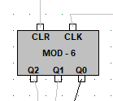 
 </p>
 <p align="center">
   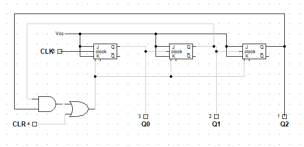 
 </p>

<br></br>

#### Contador BCD

<p align="center">
   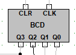 
 </p>
 <p align="center">
   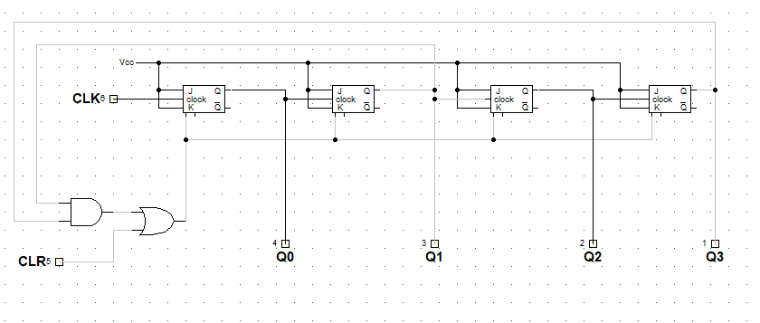 
 </p>

<br></br>

## Formato AM/PM e 24 horas

<p>Para implementar a mudança entre o formato de 24 horas e o formato de AM/PM no módulo das horas, foi necessário incorporar um somador-subtrator ao circuito. Esse componente permite adicionar ou subtrair 12 horas ao valor atual, conforme necessário, facilitando a transição entre os diferentes formatos de tempo.

Por exemplo, quando o relógio marca 1h da manhã (AM), não é necessário adicionar 12 horas ao horário atual ao mudar para o formato de 24 horas. No entanto, quando o relógio marca 1h da tarde (PM) e ocorre a mudança de formato, o circuito automaticamente adiciona 12 horas ao horário atual, convertendo-o para o formato de 24 horas, assim as horas que eram 1h(PM) passa a ser 13h(formato 24h).

Uma das dificuldades adicionais encontradas foi a decodificação dos números binários para exibição nos displays de 7 segmentos. Esses displays são capazes de mostrar apenas os números de 0 a 9, então como exibir os valores de 10 a 23? A solução foi desenvolver um decodificador de 5 bits, abrangendo a faixa de 0 a 31. Esse decodificador manipula os bits de entrada para que sejam exibidos corretamente em formato BCD nos displays de 7 segmentos.

Por exemplo, quando a hora é 20h, o decodificador separa os algoritmos para os dígitos 2 e 0, permitindo que cada display de 7 segmentos exiba os dígitos separadamente, proporcionando uma visualização clara e precisa da hora atual no formato de 24 horas. Essa abordagem resolve o problema de exibição de horas acima de 9 nos displays de 7 segmentos, garantindo uma representação completa e legível do tempo.</p>

<p align="center">
  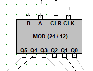
</p>
<p align="center">
  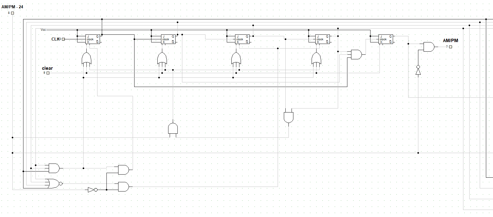
</p>
<p align="center">
  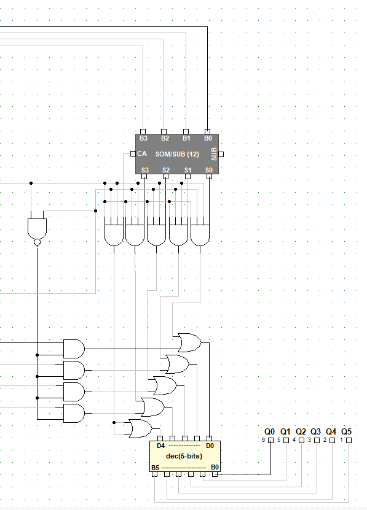
</p>

<br></br>

## Decodificador de 5 bits

<br></br>

<p align="center">
  
</p>

<br></br>

## Decodficador BCD para 7segmentos

<br></br>

<p align="center">
  
</p>

<br></br>

<p align="center">
  
</p>

# Conclusões

<p> Este projeto foi uma oportunidade valiosa para aprimorar minhas habilidades de raciocínio lógico e trabalhar com números binários em um ambiente prático. Ao enfrentar desafios como decodificação de números binários e implementação de circuitos de contagem, fui capaz de desenvolver minha capacidade de resolver problemas de forma eficaz e encontrar soluções criativas. Essa experiência não apenas solidificou meus conhecimentos em lógica digital, mas também me preparou para enfrentar desafios semelhantes em futuros projetos de programação que envolva raciocíonio lógico.</p>

<br>

## Recomendações sobre eletrônica digital 

<p>
  <a href="https://youtu.be/cG7wemiantQ?si=bvzGcG1oVMAjkyOI">Somador-Subtrator</a>
</p>
<p>
  <a href="https://youtu.be/2_UE7Pl-1yE?si=qpLeCtb88uoFj68M">Flip-Flop</a>
</p>
<p>
  <a href="https://youtu.be/XX76xNpDu68?si=zhYbO8m6KBGg2IR1">Contadores</a>
</p>

<br>

# Contatos

<p> Linkedin: 
  <a href="www.linkedin.com/in/gabrielplamer">gabrielplamer</a>
</p>
<p> Email: gabrielplamerif@gmail.com
</p>
<p> Contato: 53999602701
</p>

#
